第一次使用git环境搭建

1、配置用户名

git config --global user.name "wangyaya"

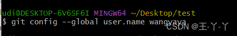

如果已经创建用户名可以通过 git config --global user.name  来查看

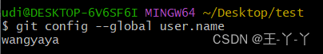

 2、配置邮件地址

git config --global user.email  "xxx邮箱号"

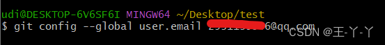

 如果已经创建邮箱号可以通过命令  git config --global user.email 查看

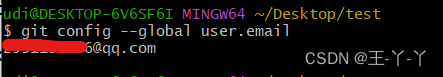

 三、使用git上传代码

1、新建一个文件夹，右键点击git Bash Here ，跳出终端命令窗

 2、输入 git  init  新建一个git 仓库文件夹

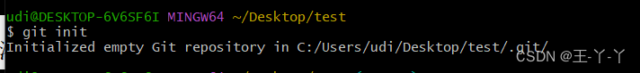

 在建立完之后会在文件夹中出现  .git文件夹

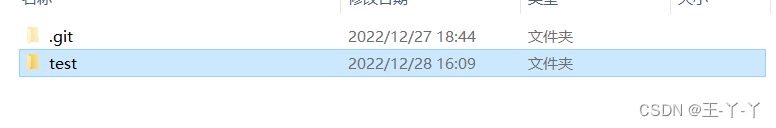

3、进入仓库添加远程地址（克隆github上项目地址）

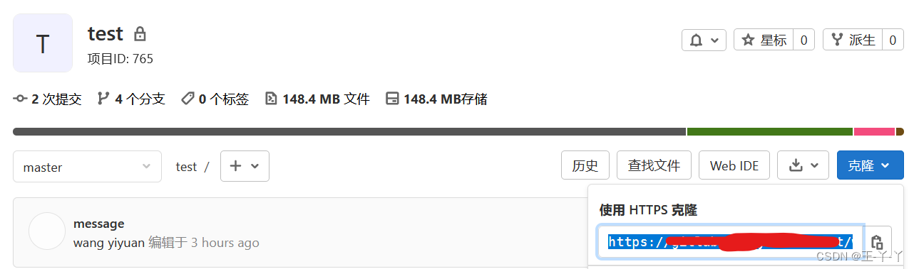

 使用命令   git remote add origin  ×××   添加远程仓地址

 通过 git remote -v 查看远程仓是否关联成功

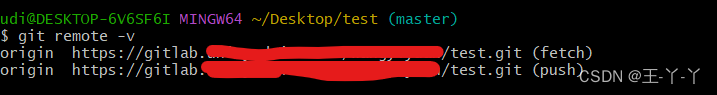

 4、进行代码提交

git add .   将新的代码问及那或修改后的文件添加到存储库中

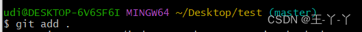

 git commit -m "对上传代码进行一些备注"

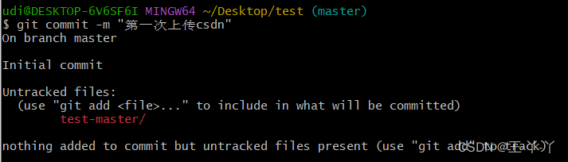

 git push origin   master   将代码上传至master分支（如果想要上传至其他分支需要修改分支名）

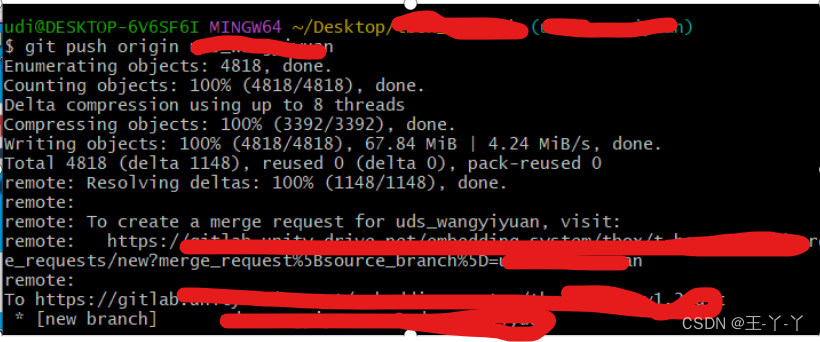