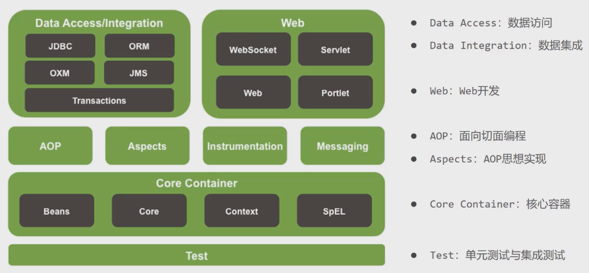
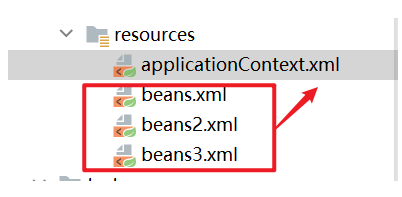

# 1. Spring

## 概述



### IOC控制反转

IOC就是将对象由Spring去创建，管理，装配

### 控制什么？

控制创建对象的方式；

### 谁来控制？

原本应用程序的对象是通过程序本身控制创建，

加入Spring后，对象由Spring来创建；

### 反转？

程序本身不再创建对象了，而是被动接收Spring创建的对象；

### 依赖注入DI？

就是利用set方法进行注入；

### IOC本质

- IOC控制反转 inversion of control
- IOC是一种编程思想，由主动编程变成被动的接收对象
- IOC是Spring框架的核心内容
- IOC是一种通过描述（XML或注解）并通过第三方去生产或获取特定对象的方式

## HelloSpring

hello.java

```java
package com.kuang.pojo;

public class Hello {

    private  String str;


    public String getStr() {
        return str;
    }

    public void setStr(String str) {
        this.str = str;
    }

    @Override
    public String toString() {
        return "Hello{" +
                "str='" + str + '\'' +
                '}';
    }
}

```

beans.xml

```xml 
<?xml version="1.0" encoding="UTF-8"?>
<beans xmlns="http://www.springframework.org/schema/beans"
xmlns:xsi="http://www.w3.org/2001/XMLSchema-instance"
xsi:schemaLocation="http://www.springframework.org/schema/beans
https://www.springframework.org/schema/beans/spring-beans.xsd">
    <!--使用Spring来创建对象，在spring这些都称之Bean  一个bean == 一个对象    new Hello()
        类型 变量名 = new 类型();
        Hello hello = new Hello();

        id == 变量名
        class == new 的对象
        property == 给对象中的属性设置一个值
    -->
    
    <bean id="hello" class="com.kuang.pojo.Hello">
        <property name="str" value="Spring"></property>
    </bean>

</beans>

```

MyTest.java

```java
import com.kuang.pojo.Hello;
import org.springframework.context.ApplicationContext;
import org.springframework.context.support.ClassPathXmlApplicationContext;

public class MyTest {

    public static void main(String[] args) {

        // 1、获取Spring的上下文对象，拿到Spring容器
        // 允许容器从各种外部资源（如本地文件系统、Java 等）加载配置元数据。ApplicationContext CLASSPATH
        ApplicationContext context = new ClassPathXmlApplicationContext("beans.xml");
        
        // 2、容器在手，天下我有，需要什么，直接从容器中获取
        // 我们的对象现在都在Spring中管理了，我们要使用对象，不用new，直接从ApplicationContext里面取出来就行
        Hello hello = (Hello) context.getBean("hello");
        System.out.println(hello.toString());
    }
}

```

## IOC创建对象的方式

### 无参构造

默认使用无参构造创建，如果将User实体类中定义的无参构造删除，只写入有参构造方法，就会报错

### 有参构造

第一种：下标赋值

```xml
<bean id="user" class="com.kuang.pojo.User">
    <!-- constructor-arg：constructor argument 构造函数参数   
		index="0"表示第一个参数下标为0，value="狂神说Java"-->
    <constructor-arg index="0" value="狂神说Java"></constructor-arg>
</bean>

```

第二种：参数名【推荐】

```xml
<!--第二种：直接通过参数名设置-->
<bean id="user" class="com.kuang.pojo.User">
    <constructor-arg name="name" value="qingjiang"></constructor-arg>
</bean>

```

总结：

**Spring容器， 就类似于婚介所，不管你要不要，婚介所都有已经存在的对象**

**如果对象你想要，直接获取就行，而婚介所中存在的每个对象都独一无二**

在配置文件加载的时候，容器中的管理对象就已经初始化了！

## 配置

### 1.别名

```xml
<bean id="user" class="com.kuang.pojo.User">
    <constructor-arg name="name" value="qingjiang"></constructor-arg>
</bean>

<!--别名：如果添加了别名，我们也可以通过别名来获取这个对象-->
<alias name="user" alias="userNew"></alias>
```

### 2.bean的配置

```xml
<!--
        id : bean的唯一标识符，也及时相当于我们学的对象名
        class : bean对象对应的全限定名： 包名 + 类名
        name : 给bean创建的对象起名字，name比起alias更高级,可以起多个别名
    -->
<bean id="userT" class="com.kuang.pojo.UserT" name="user2 u2, u3, u4" >
    <property name="name" value="西部开源"></property>
</bean>
```

### 3.import导入

一般用于团队开发；可以将多个配置文件，导入合并为一个applicationContext.xml

```xml
<?xml version="1.0" encoding="UTF-8"?>
<beans xmlns="http://www.springframework.org/schema/beans"
       xmlns:xsi="http://www.w3.org/2001/XMLSchema-instance"
       xsi:schemaLocation="http://www.springframework.org/schema/beans
        https://www.springframework.org/schema/beans/spring-beans.xsd">

    <import resource="beans.xml"></import>
    <import resource="beans2.xml"></import>
    <import resource="beans3.xml"></import>
</beans>
```



## DI依赖注入

### 1.构造器注入

### 2.set注入【重点】

- 依赖注入：Set注入
  - 依赖：bean对象的创建依赖于容器！
  - 注入：bean对象中的所有属性，由容器来注入！

student.java

```java
package com.kuang.pojo;

import java.util.*;

public class Student {

    private String name;
    private Address address;
    private String[] books;
    private List<String> hobbys;
    private Map<String,String> card;//学生卡
    private Set<String> games;
    private String wife; //妻子，空指针null
    private Properties info;//学生信息

    public String getName() {
        return name;
    }

    public void setName(String name) {
        this.name = name;
    }

    public Address getAddress() {
        return address;
    }

    public void setAddress(Address address) {
        this.address = address;
    }

    public String[] getBooks() {
        return books;
    }

    public void setBooks(String[] books) {
        this.books = books;
    }

    public List<String> getHobbys() {
        return hobbys;
    }

    public void setHobbys(List<String> hobbys) {
        this.hobbys = hobbys;
    }

    public Map<String, String> getCard() {
        return card;
    }

    public void setCard(Map<String, String> card) {
        this.card = card;
    }

    public Set<String> getGames() {
        return games;
    }

    public void setGames(Set<String> games) {
        this.games = games;
    }

    public String getWife() {
        return wife;
    }

    public void setWife(String wife) {
        this.wife = wife;
    }

    public Properties getInfo() {
        return info;
    }

    public void setInfo(Properties info) {
        this.info = info;
    }

    @Override
    public String toString() {
        return "Student{" +
                "name='" + name + '\'' +
                ", address=" + address +
                ", books=" + Arrays.toString(books) +
                ", hobbys=" + hobbys +
                ", card=" + card +
                ", games=" + games +
                ", wife='" + wife + '\'' +
                ", info=" + info +
                '}';
    }
}
```

applicationContext.xml

```xml
<?xml version="1.0" encoding="UTF-8"?>
<beans xmlns="http://www.springframework.org/schema/beans"
       xmlns:xsi="http://www.w3.org/2001/XMLSchema-instance"
       xsi:schemaLocation="http://www.springframework.org/schema/beans
        https://www.springframework.org/schema/beans/spring-beans.xsd">

    <bean id="address" class="com.kuang.pojo.Address">
        <property name="address" value="西安"></property>
    </bean>

    <bean id="student" class="com.kuang.pojo.Student">

        <!--第一种，普通值注入，String name-->
        <property name="name" value="秦疆"></property>

        <!--第二种，Bean注入，Address address-->
        <property name="address" ref="address"></property>

        <!--第三种，数组注入  String[] books-->
        <property name="books">
            <array>
                <value>红楼梦</value>
                <value>西游记</value>
                <value>三国演义</value>
            </array>
        </property>

        <!--第四种：List<String> hobbys-->
        <property name="hobbys">
            <list>
                <value>听歌</value>
                <value>敲代码</value>
                <value>看书</value>
            </list>
        </property>

        <!--第五种：Map<String,String> card;//学生卡-->
        <property name="card">
            <map>
                <entry  key="身份证" value="123712739171293"></entry>
                <entry  key="银行卡" value="234234234324344"></entry>
            </map>
        </property>

        <!--第六种: Set<String> games;-->
        <property name="games">
            <set>
                <value>LOL</value>
                <value>cf</value>
                <value>红警</value>
                <value>吃鸡</value>
            </set>
        </property>

        <!--第七种：String wife; //妻子，空指针null-->
        <property name="wife">
            <null></null>
        </property>

        <!--第八种：Properties info;//学生信息
            Properties
                key1=value1
                key2=value2
                key3=value3-->
        <property name="info">
            <props>
                <prop key="driver">231231</prop>
                <prop key="url">nan</prop>
                <prop key="username">root</prop>
                <prop key="password">231231</prop>
            </props>
        </property>
    </bean>

</beans>

```

测试类

```java
import com.kuang.pojo.Student;
import org.springframework.context.ApplicationContext;
import org.springframework.context.support.ClassPathXmlApplicationContext;

public class MyTest {
    public static void main(String[] args) {
        //引入applicationContext.xml配置文件，生成ApplicationContext,要获取对象的时候，只需要从context中获取就行
        ApplicationContext applicationContext = new ClassPathXmlApplicationContext("applicationContext.xml");
        //拿到student的对象 == 拿到student的bean
        Student student = (Student) applicationContext.getBean("student");
        //输出student对象中name属性的value值
        System.out.println(student.toString());
        /*
            Student{
                name='秦疆',
                address=Address{address='西安'},
                books=[红楼梦, 西游记, 三国演义],
                hobbys=[听歌, 敲代码, 看书],
                card={
                        身份证=123712739171293,
                        银行卡=234234234324344
                },
                games=[LOL, cf, 红警, 吃鸡],
                wife='null',
                info={
                    password=231231,
                    url=nan,
                    driver=231231,
                    username=root
                }
            }
         */
    }
}

```

### 3.命名空间快捷注入

P命名空间：

```xml
xmlns:p="http://www.springframework.org/schema/p"   
```

C命名空间：

```xml
xmlns:c="http://www.springframework.org/schema/c"
```

使用方法：

```xml
<beans xmlns="http://www.springframework.org/schema/beans"
       xmlns:xsi="http://www.w3.org/2001/XMLSchema-instance"
       xmlns:p="http://www.springframework.org/schema/p"
       xmlns:c="http://www.springframework.org/schema/c"
       xsi:schemaLocation="http://www.springframework.org/schema/beans
        https://www.springframework.org/schema/beans/spring-beans.xsd">

    <!-- p命名空间注入，可以直接注入属性的值  p: property 属性注入-->
    <bean id="user" class="com.kuang.pojo.User" p:name="秦疆" p:age="18"></bean>

    <!-- c命名空间注入, c: constructor 构造器注入  User实体类中要写入构造方法-->
    <bean id="user2" class="com.kuang.pojo.User" c:age="18" c:name="狂神"></bean>
</beans>

```

注意：p命名和c命名空间不能直接使用，需要导入xml头部约束！

